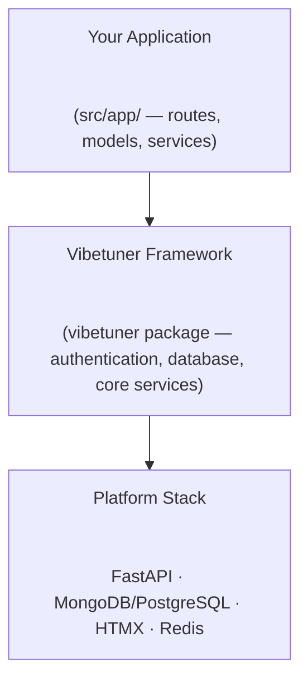
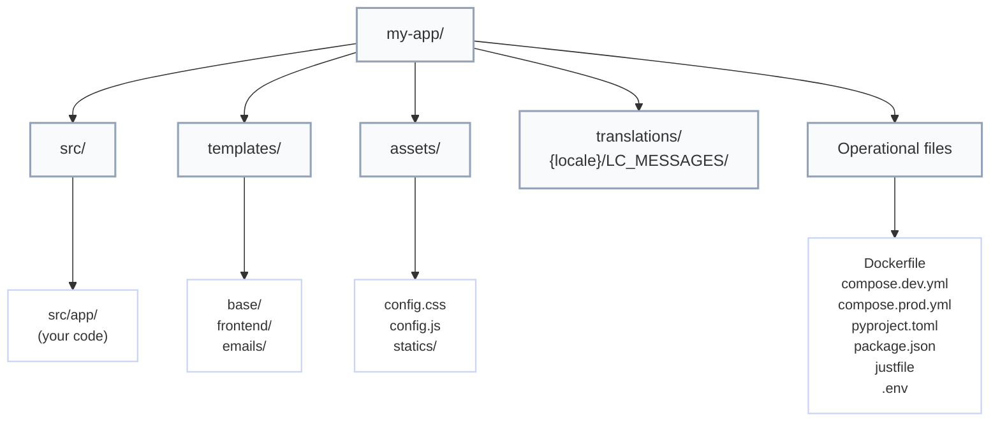
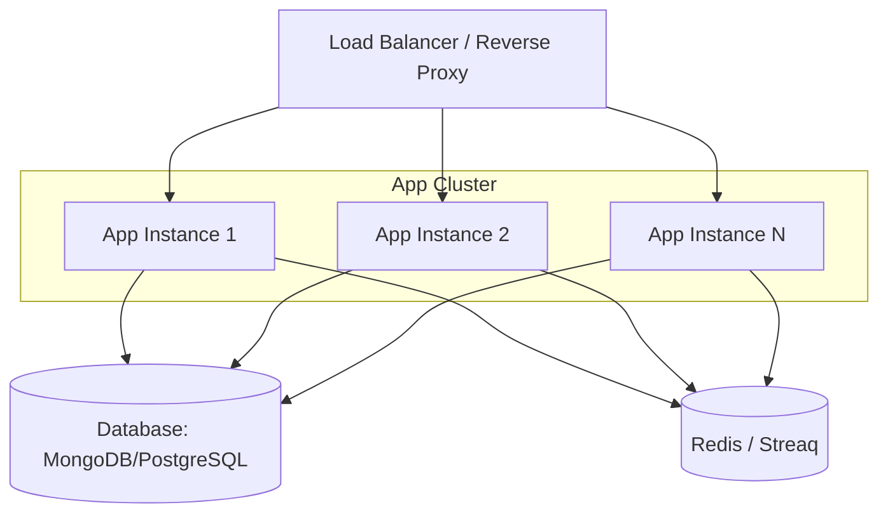

# Architecture

Understanding Vibetuner's system design and structure.

## High-Level Overview

Vibetuner generates full-stack web applications with clear separation between framework code and application code.



## Three-Package Architecture

Vibetuner consists of three components:

### 1. Scaffolding Template

**Location**: Root repository (`copier.yml`, `vibetuner-template/`)
The Copier-based template that generates new projects:

- Interactive project setup
- Configurable features (OAuth, background jobs, etc.)
- Generates complete project structure
- Updates existing projects
**Command**: `uvx vibetuner scaffold new my-app`

### 2. Python Package (`vibetuner`)

**Location**: `vibetuner-py/`
Published to PyPI, provides:

- Core framework code
- Authentication system
- Database integration
- Email and storage services
- CLI commands
- Blessed dependency stack
**Install**: `uv add vibetuner`

### 3. JavaScript Package (`@alltuner/vibetuner`)

**Location**: `vibetuner-js/`
Published to npm, provides:

- Frontend build dependencies (Tailwind, esbuild, etc.)
- Version-locked with Python package
- No runtime dependencies
**Install**: `bun add @alltuner/vibetuner`

## Generated Project Structure



Key directories:

- `vibetuner` package: framework code installed as a dependency (auth, database,
CLI, shared services). Do not edit.
- `src/app/`: your application space—add routes, models, services, and optional
background jobs here.
- `templates/`: Jinja2 templates divided into base layouts, frontend pages, and
email templates.
- `assets/`: Tailwind and JavaScript entry points plus compiled bundles
(`statics/`).
- `translations/`: Babel-compatible locale directories (`LC_MESSAGES/messages.po`).
- Operational files: container configs, dependency manifests, and tooling
(`Dockerfile`, `compose.*.yml`, `pyproject.toml`, `package.json`, `justfile`,
`.env`).

## Request Flow

### 1. HTTP Request

```text
Client → Nginx/Caddy → FastAPI (Granian) → Route Handler
```

### 2. Route Handler

```python
# src/app/frontend/routes/blog.py
@router.get("/blog/{post_id}")
async def view_post(post_id: str):
post = await Post.get(post_id)
return templates.TemplateResponse("blog/post.html.jinja", {
"post": post
})
```

### 3. Database Query

```text
# MongoDB
Route → Beanie ODM → Motor (async) → MongoDB

# SQL
Route → SQLModel → SQLAlchemy (async) → PostgreSQL/MySQL/SQLite
```

### 4. Template Rendering

```text
Jinja2 Template → HTML with HTMX → Client
```

### 5. HTMX Interaction

```text
User Action → HTMX Request → FastAPI → Partial HTML → Update DOM
```

## Core Components

### FastAPI Application

**Location**: `src/app/frontend/__init__.py`
Application initialization and middleware stack:

```python
from fastapi import FastAPI
from vibetuner.frontend.middleware import setup_middleware
from app.frontend.routes import blog, api
app = FastAPI()
setup_middleware(app)  # Auth, sessions, i18n, static files
app.include_router(blog.router)
app.include_router(api.router)
```

### Database Layer

Vibetuner supports multiple database backends:

**MongoDB**: `vibetuner.mongo`

```python
from vibetuner.mongo import init_mongodb

# Called during application startup if MONGODB_URL is configured
await init_mongodb()
```

**SQL (PostgreSQL, MySQL, SQLite)**: `vibetuner.sqlmodel`

```python
from vibetuner.sqlmodel import init_sqlmodel, create_schema

# Called during application startup if DATABASE_URL is configured
await init_sqlmodel()

# Create tables (run via CLI: vibetuner db create-schema)
await create_schema()
```

Models are automatically discovered and registered from:

- `vibetuner.models` (core models: User, OAuth, etc.)
- `app.models` (your application models)

### Authentication System

**Location**: `vibetuner.frontend.auth`
Dual authentication with OAuth and magic links:

```text
OAuth Flow:
1. User clicks "Sign in with Google"
2. Redirect to Google OAuth
3. Google redirects back with code
4. Exchange code for user info
5. Create/update user in database
6. Create session
Magic Link Flow:
1. User enters email
2. Generate secure token
3. Send email with link
4. User clicks link
5. Verify token
6. Create session
```

### Session Management

HTTP-only, secure cookies with server-side validation:

```python
session_data = {
"user_id": str(user.id),
"created_at": datetime.utcnow()
}
session_id = secrets.token_urlsafe(32)
await redis.setex(f"session:{session_id}", SESSION_MAX_AGE, json.dumps(session_data))
```

### Background Jobs

**Location**: `src/app/tasks/`
Optional Redis-based background processing using Streaq:

```python
# Define task in src/app/tasks/emails.py
from vibetuner.tasks.worker import worker

@worker.task()
async def send_welcome_email(user_id: str):
    user = await User.get(user_id)
    await email_service.send(user.email, "welcome")
    return {"status": "sent"}

# Queue task from routes
from app.tasks.emails import send_welcome_email
task = await send_welcome_email.enqueue(user_id="123")
```

**Lifespan Management**: Tasks use `src/app/tasks/lifespan.py` for worker lifecycle:

```python
# src/app/tasks/lifespan.py
@asynccontextmanager
async def lifespan():
    async with base_lifespan() as worker_context:
        # Custom startup logic
        yield CustomContext(**worker_context.model_dump())
        # Custom shutdown logic
```

Worker process runs separately:

```bash
just worker-dev  # Development
docker compose up worker  # Production
```

## Frontend Architecture

### Template Hierarchy

```text
base/skeleton.html.jinja         # Base layout
└── base/auth.html.jinja         # Requires authentication
└── dashboard.html.jinja     # Specific page
```

### HTMX Patterns

**Partial Updates**:

```html
<div id="posts">
    <button hx-get="/posts?page=2" hx-target="#posts" hx-swap="beforeend">Load More</button>
</div>
```

**Form Submission**:

```html
<form hx-post="/comments" hx-target="#comments" hx-swap="afterbegin">
    <textarea name="content"></textarea>
    <button type="submit">Post Comment</button>
</form>
```

**Server Response**:

```python
@router.post("/comments")
async def create_comment(content: str):
comment = await Comment(content=content).insert()
return templates.TemplateResponse("comments/item.html.jinja", {
"comment": comment
})
```

### Asset Pipeline

**Development**:

```bash
bun dev  # Watch mode
```

Compiles:

- `assets/config.css` → `assets/statics/css/bundle.css`
- `assets/config.js` → `assets/statics/js/bundle.js`
**Production**:

```bash
bun build-prod
```

Minifies and optimizes for production.

## Configuration Management

**Location**: `vibetuner.config`
Pydantic Settings with environment variable support:

```python
class Settings(BaseSettings):
# Automatic from .env or environment
DATABASE_URL: str
SECRET_KEY: str
DEBUG: bool = False
# OAuth
GOOGLE_CLIENT_ID: str | None = None
GOOGLE_CLIENT_SECRET: str | None = None
class Config:
env_file = ".env"
settings = Settings()
```

## Deployment Architecture

### Docker Multi-Stage Build

```dockerfile
# Stage 1: Base with uv
FROM python:3.14-slim as python-base
RUN apt-get update && apt-get install -y git
COPY --from=ghcr.io/astral-sh/uv:0.9 /uv /bin/

# Stage 2: Dependencies only (cached layer)
FROM python-base as python-deps
RUN uv sync --locked --no-install-project --no-group dev

# Stage 3: Install project (non-editable)
FROM python-deps as python-app
COPY src/ src/
RUN uv sync --locked --no-editable --no-group dev

# Stage 4-6: Locales and frontend (parallel)
FROM oven/bun:1-alpine as frontend-build
RUN bun install --frozen-lockfile && bun run build-prod

# Stage 7: Runtime (fresh base, no build tools)
FROM python:3.14-slim as runtime
COPY --from=python-app /app/.venv/ .venv/
COPY --from=frontend-build /app/assets/statics/ assets/statics/
COPY templates/ templates/
ENV PATH="/app/.venv/bin:$PATH"
CMD ["granian", "--host", "0.0.0.0", "--port", "8000", "vibetuner.frontend:app"]
```

Key optimizations:

- **Non-editable install**: App lives in `.venv/lib/python3.x/site-packages/app/`, no `src/` in runtime
- **Separate dependency layer**: Cached when only app code changes
- **Fresh runtime base**: No git/uv in production image
- **Parallel builds**: Locales and frontend build concurrently

### Production Stack



## Scaling Considerations

### Horizontal Scaling

- Run multiple application instances
- Use Redis for session storage
- Load balance with Nginx/Caddy
- Database connection pooling

### Database Scaling

**MongoDB:**

- Replica sets for high availability
- Read replicas for read-heavy workloads
- Sharding for very large datasets

**PostgreSQL:**

- Streaming replication for high availability
- Read replicas for read-heavy workloads
- Connection pooling (PgBouncer)

**Both:**

- Indexes on frequently queried fields
- Connection pooling for efficiency

### Caching Strategy

- Redis for session data
- Redis for rate limiting
- Redis for job queues
- Application-level caching for expensive queries

### Asset Delivery

- Serve static files from CDN
- Use cache headers appropriately
- Minify and compress assets
- Implement versioned URLs

## Security Architecture

### Authentication

- OAuth 2.0 with secure providers
- Magic links with time-limited tokens
- HTTP-only secure cookies
- CSRF protection with SameSite cookies

### Database

- Connection string authentication
- Network isolation (VPC)
- TLS/SSL connections
- Regular backups

### Application

- Environment-based secrets
- Input validation with Pydantic
- SQL injection protection (ODM/ORM)
- XSS protection (Jinja2 auto-escaping)
- HTTPS enforcement in production

## Monitoring Points

### Application

- Request/response times
- Error rates
- Active sessions
- Background job queue length

### Database

- Query performance
- Connection pool usage
- Disk usage
- Replica lag

### Infrastructure

- CPU/Memory usage
- Network throughput
- Disk I/O
- Container health

## Next Steps

- [Development Guide](development-guide.md) - Build features
- [Deployment](deployment.md) - Deploy to production
- [Tech Stack](tech-stack.md) - Technology choices
