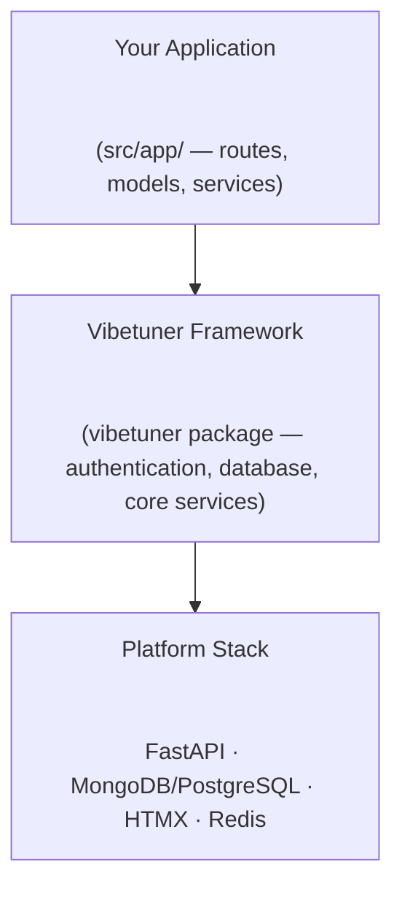
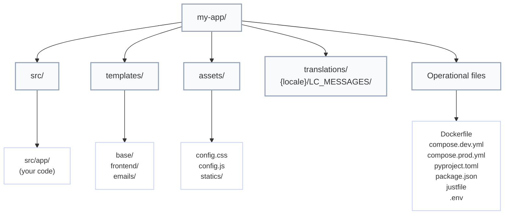
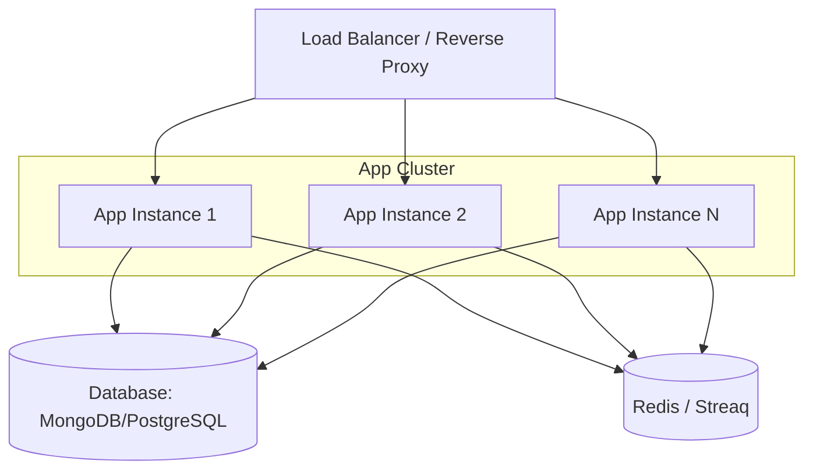

# Architecture

Understanding Vibetuner's system design and structure.

!!! note "Package name convention"
    In all examples, `app` refers to your project's Python package (the directory under `src/`).
    The actual name depends on your project slug (e.g., `src/myproject/` for a project named
    "myproject").

## High-Level Overview

Vibetuner generates full-stack web applications with clear separation between framework code and application code.



## Three-Package Architecture

Vibetuner consists of three components:

### 1. Scaffolding Template

**Location**: Root repository (`copier.yml`, `vibetuner-template/`)
The Copier-based template that generates new projects:

- Interactive project setup
- Configurable features (OAuth, background jobs, etc.)
- Generates complete project structure
- Updates existing projects
**Command**: `uvx vibetuner scaffold new my-app`

### 2. Python Package (`vibetuner`)

**Location**: `vibetuner-py/`
Published to PyPI, provides:

- Core framework code
- Authentication system
- Database integration
- Email and storage services
- CLI commands
- Blessed dependency stack
**Install**: `uv add vibetuner`

### 3. JavaScript Package (`@alltuner/vibetuner`)

**Location**: `vibetuner-js/`
Published to npm, provides:

- Frontend build dependencies (Tailwind, esbuild, etc.)
- Version-locked with Python package
- No runtime dependencies
**Install**: `bun add @alltuner/vibetuner`

## Generated Project Structure



Key directories:

- `vibetuner` package: framework code installed as a dependency (auth, database,
CLI, shared services). Do not edit.
- `src/app/`: your application space—add routes, models, services, and optional
background jobs here.
- `templates/`: Jinja2 templates divided into base layouts, frontend pages, and
email templates.
- `assets/`: Tailwind and JavaScript entry points plus compiled bundles
(`statics/`).
- `translations/`: Babel-compatible locale directories (`LC_MESSAGES/messages.po`).
- Operational files: container configs, dependency manifests, and tooling
(`Dockerfile`, `compose.*.yml`, `pyproject.toml`, `package.json`, `justfile`,
`.env`).

## Request Flow

### 1. HTTP Request

```text
Client → Nginx/Caddy → FastAPI (Granian) → Route Handler
```

### 2. Route Handler

```python
# src/app/frontend/routes/blog.py
@router.get("/blog/{post_id}")
async def view_post(post_id: str):
post = await Post.get(post_id)
return templates.TemplateResponse("blog/post.html.jinja", {
"post": post
})
```

### 3. Database Query

```text
# MongoDB
Route → Beanie ODM → Motor (async) → MongoDB

# SQL
Route → SQLModel → SQLAlchemy (async) → PostgreSQL/MySQL/SQLite
```

### 4. Template Rendering

```text
Jinja2 Template → HTML with HTMX → Client
```

### 5. HTMX Interaction

```text
User Action → HTMX Request → FastAPI → Partial HTML → Update DOM
```

## Vibetuner Package Modules

The `vibetuner` Python package provides the following key modules:

| Module | Description |
|--------|-------------|
| `vibetuner.config` | Pydantic Settings with environment variable support |
| `vibetuner.runtime_config` | Layered runtime configuration (MongoDB + in-memory) |
| `vibetuner.rendering` | Jinja2 template rendering with context providers |
| `vibetuner.crud` | Generic CRUD route factory for Beanie documents |
| `vibetuner.sse` | Server-Sent Events helpers with Redis pub/sub |
| `vibetuner.testing` | Pytest fixtures for test client, mock auth, mock tasks |
| `vibetuner.mongo` | MongoDB connection and model registration |
| `vibetuner.sqlmodel` | SQLModel/SQLAlchemy integration |
| `vibetuner.frontend` | FastAPI app, auth, middleware, route discovery |
| `vibetuner.services` | DI wrappers for email, blob storage, runtime config |
| `vibetuner.tasks` | Background job infrastructure (Streaq worker, robust tasks) |
| `vibetuner.cli` | CLI commands (scaffold, run, db, doctor) |
| `vibetuner.templates` | Static template rendering utilities |

### Services Module (`vibetuner.services`)

Provides FastAPI dependency injection wrappers and centralized error messages:

- `get_email_service()` — DI wrapper for `EmailService`
- `get_blob_service()` — DI wrapper for `BlobService`
- `get_runtime_config()` — DI wrapper for `RuntimeConfig` with cache refresh
- `vibetuner.services.errors` — Rich error panels with actionable fix
  instructions for unconfigured services (MongoDB, Redis, S3/R2, Email)

### Tasks Module (`vibetuner.tasks`)

Background job infrastructure built on Streaq and Redis:

- `worker.py` — Streaq worker setup and configuration
- `context.py` — Task context management (DB, HTTP client)
- `robust.py` — `@robust_task` decorator with exponential backoff retries
  and MongoDB dead letter collection for permanently failed tasks

### CLI Module (`vibetuner.cli`)

- `scaffold` — Create and update projects from the Copier template
- `run` — Development and production server management
- `db` — Database schema commands (`create-schema`)
- `doctor` — Validate project setup (structure, env vars, service
  connectivity, models, templates, dependencies, port availability)

## Core Components

### FastAPI Application

The vibetuner framework handles application initialization automatically. Routes are
**auto-discovered** from `src/app/frontend/routes/`:

```python
# src/app/frontend/routes/blog.py - automatically registered
from fastapi import APIRouter

router = APIRouter(prefix="/blog", tags=["blog"])

@router.get("/")
async def list_posts():
    return {"posts": []}
```

The framework finds any `router` variable and registers it. No manual `include_router()` needed.

### Database Layer

Vibetuner supports multiple database backends:

**MongoDB**: `vibetuner.mongo`

```python
from vibetuner.mongo import init_mongodb

# Called during application startup if MONGODB_URL is configured
await init_mongodb()
```

**SQL (PostgreSQL, MySQL, SQLite)**: `vibetuner.sqlmodel`

```python
from vibetuner.sqlmodel import init_sqlmodel, create_schema

# Called during application startup if DATABASE_URL is configured
await init_sqlmodel()

# Create tables (run via CLI: vibetuner db create-schema)
await create_schema()
```

Models are automatically discovered and registered from:

- `vibetuner.models` (core models: User, OAuth, etc.)
- `app.models` (your application models)

### Authentication System

**Location**: `vibetuner.frontend.auth`
Dual authentication with OAuth and magic links:

```text
OAuth Flow:
1. User clicks "Sign in with Google"
2. Redirect to Google OAuth
3. Google redirects back with code
4. Exchange code for user info
5. Create/update user in database
6. Create session
Magic Link Flow:
1. User enters email
2. Generate secure token
3. Send email with link
4. User clicks link
5. Verify token
6. Create session
```

### Session Management

HTTP-only, secure cookies with server-side validation:

```python
session_data = {
"user_id": str(user.id),
"created_at": datetime.utcnow()
}
session_id = secrets.token_urlsafe(32)
await redis.setex(f"session:{session_id}", SESSION_MAX_AGE, json.dumps(session_data))
```

### Background Jobs

**Location**: `src/app/tasks/`
Optional Redis-based background processing using Streaq:

```python
# Define task in src/app/tasks/emails.py
from vibetuner.tasks.worker import get_worker

worker = get_worker()

@worker.task()
async def send_welcome_email(user_id: str):
    user = await User.get(user_id)
    await email_service.send(user.email, "welcome")
    return {"status": "sent"}

# Queue task from routes
from app.tasks.emails import send_welcome_email
task = await send_welcome_email.enqueue(user_id="123")
```

**Lifespan Management**: For custom worker lifecycle, create `src/app/tasks/lifespan.py`:

```python
# src/app/tasks/lifespan.py (optional - only if you need custom startup/shutdown)
@asynccontextmanager
async def lifespan():
    async with base_lifespan() as worker_context:
        # Custom startup logic
        yield CustomContext(**worker_context.model_dump())
        # Custom shutdown logic
```

If no custom lifespan is provided, the framework uses `base_lifespan` automatically.

Worker process runs separately:

```bash
just worker-dev  # Development
docker compose up worker  # Production
```

### CRUD Route Factory

**Location**: `vibetuner.crud`
Generate a full set of list/create/read/update/delete routes from a Beanie
Document model with one function call:

```python
from vibetuner.crud import create_crud_routes
from app.models import Post

router = create_crud_routes(
    Post,
    prefix="/posts",
    tags=["posts"],
    sortable_fields=["created_at", "title"],
    filterable_fields=["status", "author_id"],
    searchable_fields=["title", "body"],
)
app.include_router(router)
```

Features:

- Pagination (offset/limit), sorting, equality filtering, text search
- Field selection via `?fields=title,status`
- Custom create/update/response Pydantic schemas
- Pre/post hooks for create, update, and delete operations
- FastAPI dependencies for route-level auth or rate limiting
- Configurable operation set (e.g. read-only: `{Operation.LIST, Operation.READ}`)

### Server-Sent Events (SSE)

**Location**: `vibetuner.sse`
Real-time streaming over HTTP with HTMX integration:

```python
from vibetuner.sse import sse_endpoint, broadcast

# Subscribe clients to a channel
@sse_endpoint("/events/notifications", channel="notifications", router=router)
async def notifications_stream(request: Request):
    pass  # channel kwarg handles everything

# Broadcast from anywhere (routes, tasks, services)
await broadcast("notifications", "update", data="<div>New item!</div>")
```

Architecture:

- **In-process registry** — asyncio queues per channel for single-worker
- **Redis pub/sub bridge** — optional, for multi-worker broadcasting
- **Template rendering** — broadcast rendered Jinja2 partials directly
- **Keepalive** — automatic 30-second keepalive comments
- Supports both channel-based (subscribe/broadcast) and generator-based
  (full control) endpoints

### Robust Background Tasks

**Location**: `vibetuner.tasks.robust`
Drop-in replacement for `@worker.task()` with retry and failure handling:

```python
from vibetuner.tasks.robust import robust_task

@robust_task(max_retries=5, backoff_max=600)
async def send_report(account_id: str, ctx=WorkerDepends()):
    ...
```

- Exponential backoff (`delay = base ** tries`, capped at `backoff_max`)
- Dead letter collection in MongoDB after all retries exhausted
- Optional `on_failure` callback (sync or async)
- Streaq middleware-based — works alongside normal `@worker.task()` tasks

### Testing Utilities

**Location**: `vibetuner.testing`
Pytest fixtures for testing vibetuner applications without external services:

| Fixture | Purpose |
|---------|---------|
| `vibetuner_client` | Async HTTP test client (httpx + ASGITransport) |
| `vibetuner_app` | Overridable FastAPI app fixture |
| `vibetuner_db` | Temporary MongoDB database with auto-teardown |
| `mock_auth` | Patch authentication (login/logout without sessions) |
| `mock_tasks` | Record `enqueue` calls without Redis |
| `override_config` | Override `RuntimeConfig` values with auto-cleanup |

### Template Context System

**Location**: `vibetuner.rendering`
Two mechanisms to inject variables into every template render:

```python
from vibetuner.rendering import register_globals, register_context_provider

# Static globals — merged into every render call
register_globals({"site_title": "My App", "og_image": "/static/og.png"})

# Dynamic providers — called on each render
@register_context_provider
def analytics_context() -> dict[str, Any]:
    return {"analytics_id": settings.analytics_id}
```

### Runtime Configuration

**Location**: `vibetuner.runtime_config`
Layered configuration with MongoDB persistence:

```text
Priority (highest → lowest):
1. Runtime overrides — in-memory, for debugging/testing
2. MongoDB values — persistent, survives restarts
3. Registered defaults — defined in code
```

Register config values declaratively:

```python
from vibetuner.runtime_config import config_value, ConfigGroup, ConfigField

# Decorator style
@config_value("features.dark_mode", value_type="bool", category="features")
def dark_mode() -> bool:
    return False  # default

# Class style
class FeatureFlags(ConfigGroup, category="features"):
    dark_mode = ConfigField(
        default=False, value_type="bool", description="Enable dark mode"
    )
    max_items = ConfigField(
        default=50, value_type="int", description="Max items per page"
    )
```

### Health Monitoring

**Location**: `vibetuner.frontend.routes.health`
Built-in health check endpoints:

| Endpoint | Purpose |
|----------|---------|
| `GET /health/ping` | Liveness probe (no external calls) |
| `GET /health` | Basic health with version and uptime |
| `GET /health?detailed=true` | Service-level checks with latency |
| `GET /health/ready` | Readiness probe (all services reachable) |
| `GET /health/id` | Instance identification (PID, port, startup time) |

The detailed check probes MongoDB, Redis, S3/R2, and email — reporting
status and latency for each configured service.

## Frontend Architecture

### Template Hierarchy

```text
base/skeleton.html.jinja         # Base layout
└── base/auth.html.jinja         # Requires authentication
└── dashboard.html.jinja     # Specific page
```

### HTMX Patterns

**Partial Updates**:

```html
<div id="posts">
    <button hx-get="/posts?page=2" hx-target="#posts" hx-swap="beforeend">Load More</button>
</div>
```

**Form Submission**:

```html
<form hx-post="/comments" hx-target="#comments" hx-swap="afterbegin">
    <textarea name="content"></textarea>
    <button type="submit">Post Comment</button>
</form>
```

**Server Response**:

```python
@router.post("/comments")
async def create_comment(content: str):
comment = await Comment(content=content).insert()
return templates.TemplateResponse("comments/item.html.jinja", {
"comment": comment
})
```

### Asset Pipeline

**Development**:

```bash
bun dev  # Watch mode
```

Compiles:

- `assets/config.css` → `assets/statics/css/bundle.css`
- `assets/config.js` → `assets/statics/js/bundle.js`
**Production**:

```bash
bun build-prod
```

Minifies and optimizes for production.

## Configuration Management

**Location**: `vibetuner.config`
Pydantic Settings with environment variable support:

```python
class Settings(BaseSettings):
# Automatic from .env or environment
DATABASE_URL: str
SESSION_KEY: str
DEBUG: bool = False
# OAuth
GOOGLE_CLIENT_ID: str | None = None
GOOGLE_CLIENT_SECRET: str | None = None
class Config:
env_file = ".env"
settings = Settings()
```

## Deployment Architecture

### Docker Multi-Stage Build

```dockerfile
# Stage 1: Base with uv
FROM python:3.14-slim as python-base
RUN apt-get update && apt-get install -y git
COPY --from=ghcr.io/astral-sh/uv:0.9 /uv /bin/

# Stage 2: Dependencies only (cached layer)
FROM python-base as python-deps
RUN uv sync --locked --no-install-project --no-group dev

# Stage 3: Install project (non-editable)
FROM python-deps as python-app
COPY src/ src/
RUN uv sync --locked --no-editable --no-group dev

# Stage 4-6: Locales and frontend (parallel)
FROM oven/bun:1-alpine as frontend-build
RUN bun install --frozen-lockfile && bun run build-prod

# Stage 7: Runtime (fresh base, no build tools)
FROM python:3.14-slim as runtime
COPY --from=python-app /app/.venv/ .venv/
COPY --from=frontend-build /app/assets/statics/ assets/statics/
COPY templates/ templates/
ENV PATH="/app/.venv/bin:$PATH"
CMD ["granian", "--host", "0.0.0.0", "--port", "8000", "vibetuner.frontend:app"]
```

Key optimizations:

- **Non-editable install**: App lives in `.venv/lib/python3.x/site-packages/app/`, no `src/` in runtime
- **Separate dependency layer**: Cached when only app code changes
- **Fresh runtime base**: No git/uv in production image
- **Parallel builds**: Locales and frontend build concurrently

### Production Stack



## Scaling Considerations

### Horizontal Scaling

- Run multiple application instances
- Use Redis for session storage
- Load balance with Nginx/Caddy
- Database connection pooling

### Database Scaling

**MongoDB:**

- Replica sets for high availability
- Read replicas for read-heavy workloads
- Sharding for very large datasets

**PostgreSQL:**

- Streaming replication for high availability
- Read replicas for read-heavy workloads
- Connection pooling (PgBouncer)

**Both:**

- Indexes on frequently queried fields
- Connection pooling for efficiency

### Caching Strategy

- Redis for session data
- Redis for rate limiting
- Redis for job queues
- Application-level caching for expensive queries

### Asset Delivery

- Serve static files from CDN
- Use cache headers appropriately
- Minify and compress assets
- Implement versioned URLs

## Security Architecture

### Authentication

- OAuth 2.0 with secure providers
- Magic links with time-limited tokens
- HTTP-only secure cookies
- CSRF protection with SameSite cookies

### Database

- Connection string authentication
- Network isolation (VPC)
- TLS/SSL connections
- Regular backups

### Application

- Environment-based secrets
- Input validation with Pydantic
- SQL injection protection (ODM/ORM)
- XSS protection (Jinja2 auto-escaping)
- HTTPS enforcement in production

## Monitoring Points

### Application

- Request/response times
- Error rates
- Active sessions
- Background job queue length

### Database

- Query performance
- Connection pool usage
- Disk usage
- Replica lag

### Infrastructure

- CPU/Memory usage
- Network throughput
- Disk I/O
- Container health

## Next Steps

- [Development Guide](development-guide.md) - Build features
- [Deployment](deployment.md) - Deploy to production
- [Tech Stack](tech-stack.md) - Technology choices
